# Лекция: Условные операторы в C#

## Введение

Условные операторы в языке C# позволяют изменять ход выполнения программы в зависимости от истинности или ложности определённого логического выражения.
Они используются для **ветвления** алгоритмов.

---

## Основные условные операторы

### 1. `if`

Оператор `if` выполняет блок кода только если условие истинно.

```csharp
int x = 10;

if (x > 5)
{
    Console.WriteLine("x больше 5");
}
```

**Схема работы:**


---

### 2. `if ... else`

Добавляется альтернативный блок, выполняющийся при ложном условии.

```csharp
int x = 3;

if (x > 5)
{
    Console.WriteLine("x больше 5");
}
else
{
    Console.WriteLine("x не больше 5");
}
```

**Схема:**



---

### 3. `if ... else if ... else`

Позволяет проверять несколько условий подряд.

```csharp
int x = 0;

if (x > 0)
{
    Console.WriteLine("x положительное");
}
else if (x < 0)
{
    Console.WriteLine("x отрицательное");
}
else
{
    Console.WriteLine("x равно нулю");
}
```

**Схема:**



---

### 4. Тернарный оператор `?:`

Тернарный оператор (`?:`) — это **сокращённая форма записи условного оператора `if-else`**, которая возвращает одно из двух значений в зависимости от условия.

**Синтаксис:**

```csharp
условие ? выражение1 : выражение2
```

* Если **условие истинно (true)** → выполняется `выражение1`.
* Если **условие ложно (false)** → выполняется `выражение2`.

#### Примеры использования

**Простое условие:**

```csharp
int x = 10;
string result = (x > 5) ? "Больше 5" : "Не больше 5";
Console.WriteLine(result); // Вывод: Больше 5
```

**Замена if-else:**

```csharp
Console.WriteLine(x % 2 == 0 ? "Чётное" : "Нечётное");
```

**Вложенные тернарные операторы:**

```csharp
int score = 75;
string grade = score >= 90 ? "Отлично" :
               score >= 70 ? "Хорошо" :
               score >= 50 ? "Удовлетворительно" : "Неудовлетворительно";

Console.WriteLine(grade); // Вывод: Хорошо
```

> ⚠️ Вложенные тернарные операторы могут ухудшать читаемость кода. Лучше использовать их только для простых условий.

#### Сравнение с `if-else`

| Особенность           | Тернарный оператор `?:`       | if-else                         |
| --------------------- | ----------------------------- | ------------------------------- |
| Читаемость            | Хорош для **простых условий** | Подходит для **сложной логики** |
| Количество строк      | 1 строка                      | Несколько строк                 |
| Возвращаемое значение | Всегда возвращает значение    | Необязательно                   |
| Удобство              | Для коротких проверок         | Для вложенных условий           |

---

### 5. `switch`

Используется для выбора одного из нескольких вариантов.

```csharp
int day = 3;

switch (day)
{
    case 1:
        Console.WriteLine("Понедельник");
        break;
    case 2:
        Console.WriteLine("Вторник");
        break;
    case 3:
        Console.WriteLine("Среда");
        break;
    default:
        Console.WriteLine("Другой день");
        break;
}
```

**Схема:**



---

## Итоги

* **if / else** — для проверки условий и ветвления программы.
* **else if** — для проверки нескольких условий подряд.
* **?:** — сокращённая форма условного выражения.
* **switch** — для выбора одного из множества вариантов.

Условные операторы — это фундамент для создания логики программы и построения алгоритмов.
